# Toomeet-Pos

Giải pháp quản lý cửa hàng tạp hóa và siêu thị mini.

#### Tạo tài khoản và đăng nhập
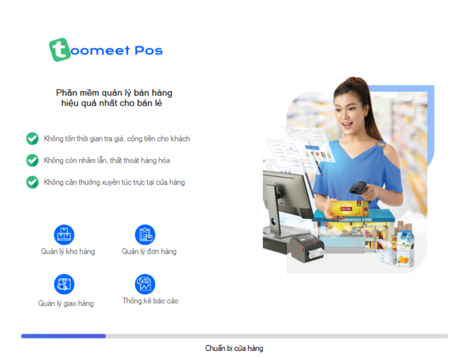
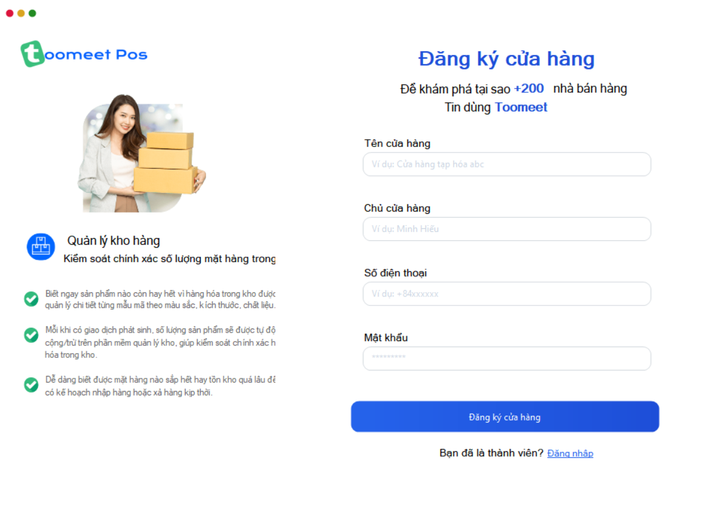
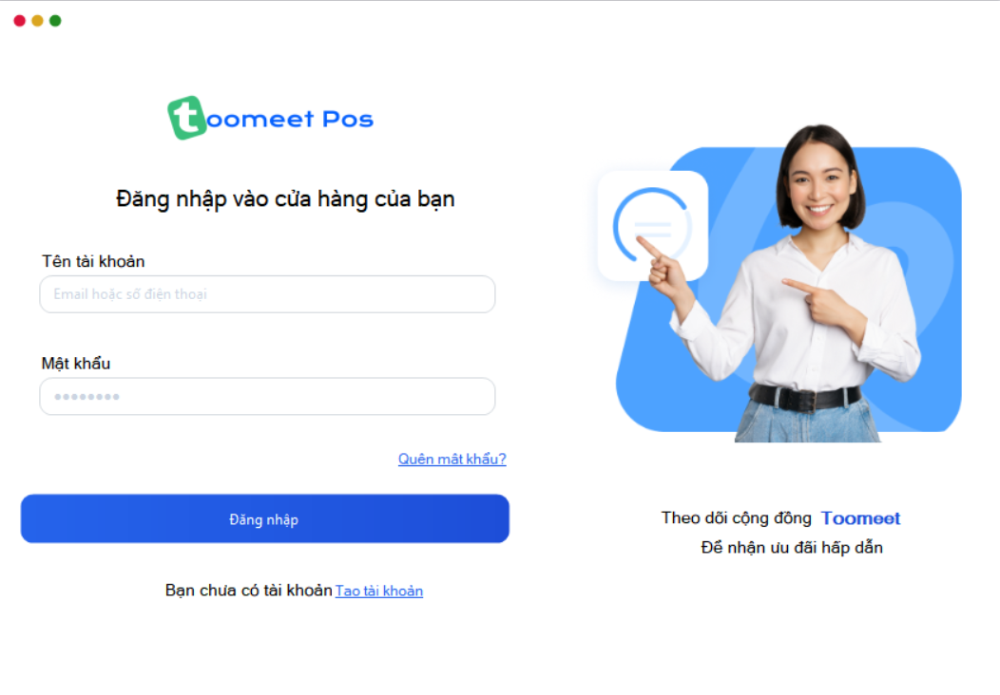

### Giao diện quản lý cửa hàng
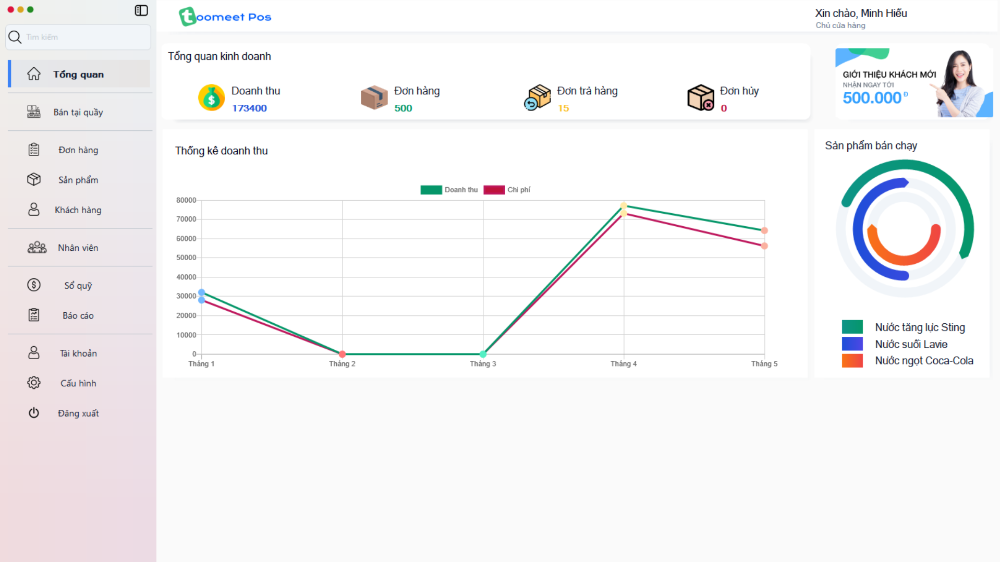
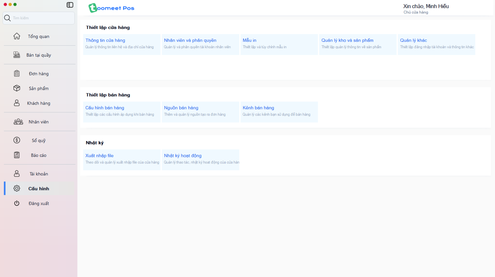

### Phân quyền nhân viên
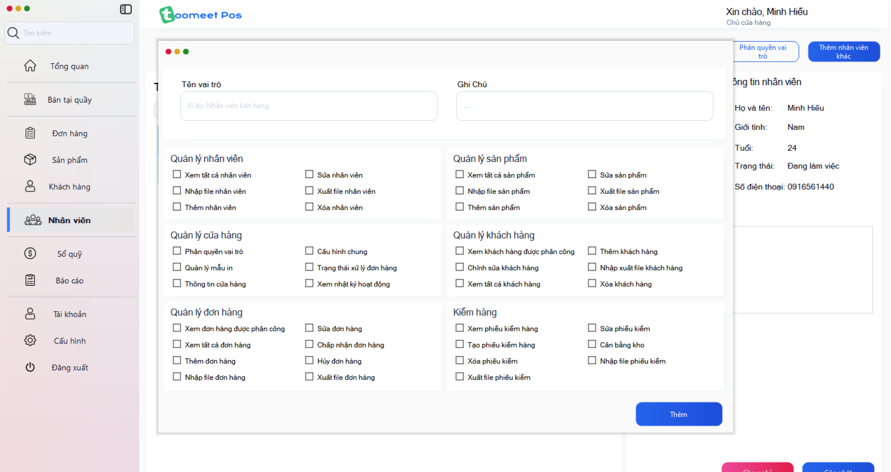

### Bán hàng tại quầy
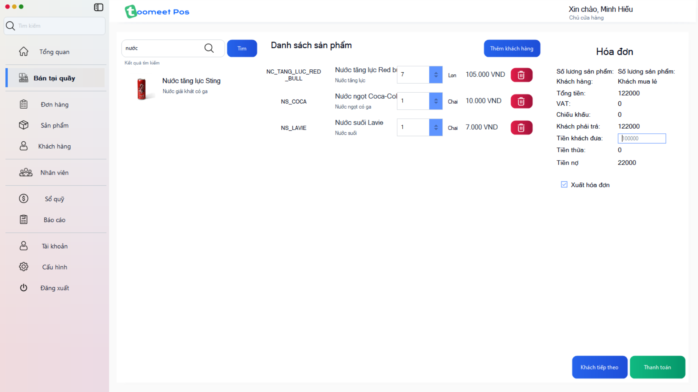

### Quản lý sản phẩm
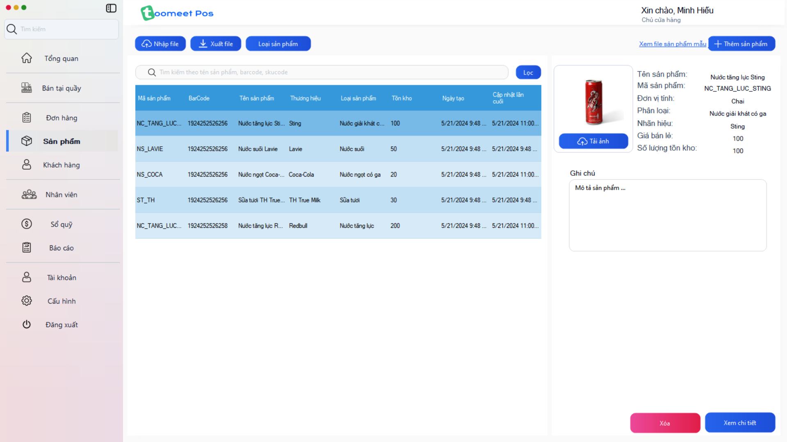

### Báo cáo excel, word
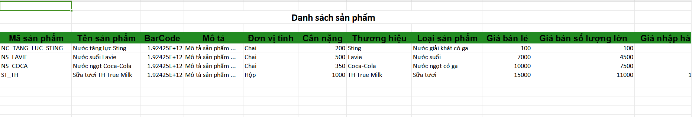
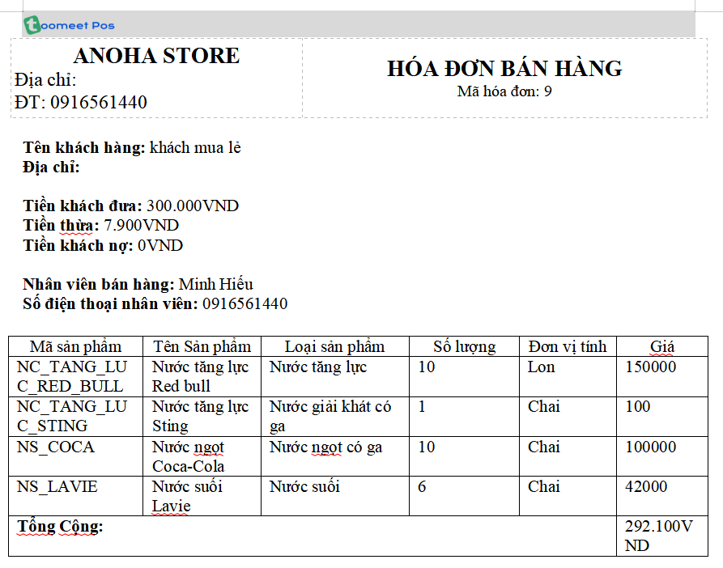

### Mời nhân viên tham gia cửa hàng
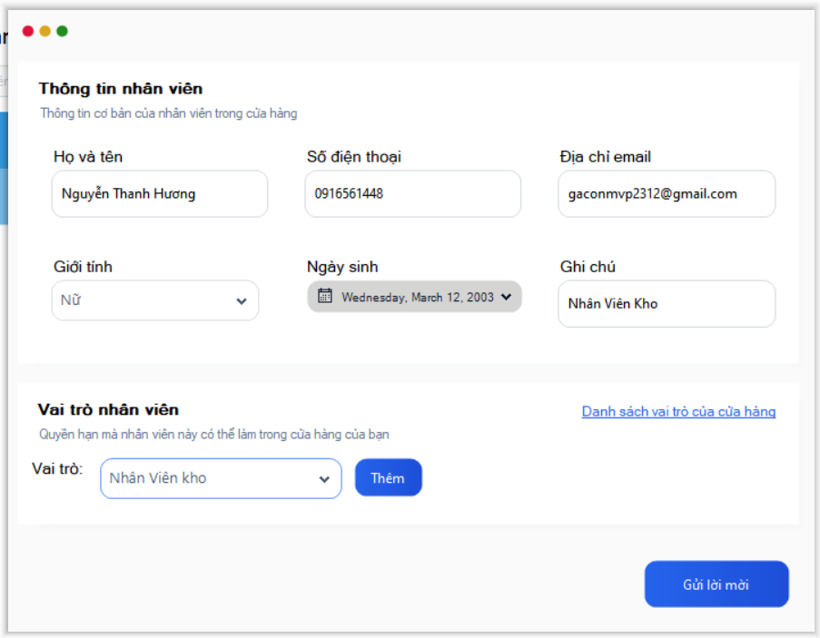
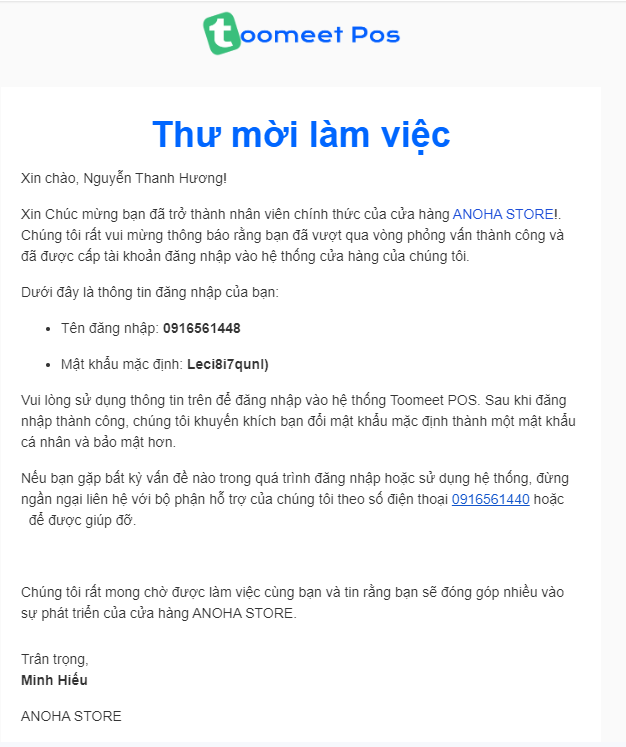

### Chỉnh sửa thông tin cá nhân
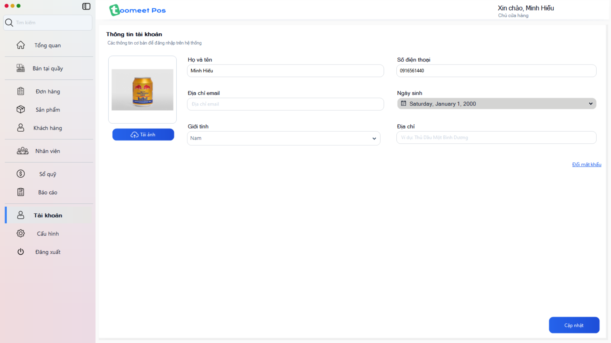
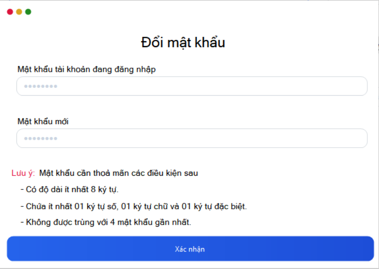

